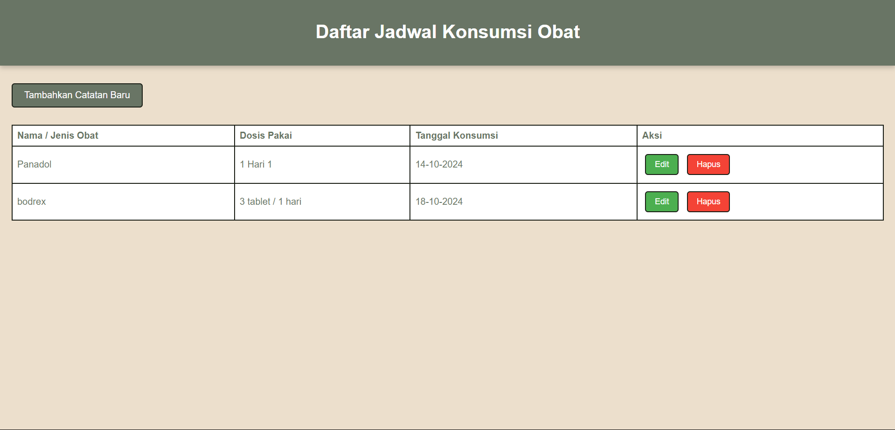

# Aplikasi Pencatatan Harian Konsumsi Obat

Aplikasi ini digunakan untuk mencatat jadwal konsumsi obat secara harian. Dibuat menggunakan **HTML**, **CSS**, **PHP** dasar, dan **SQLite** sebagai database.

## Fitur

- Menambahkan catatan konsumsi obat (nama obat, dosis, dan tanggal konsumsi).
- Mengedit catatan konsumsi obat.
- Menghapus catatan konsumsi obat.
- Melihat daftar catatan konsumsi obat dengan urutan tanggal terbaru.
- Desain responsif dan mudah digunakan.

## Lampiran


## Teknologi yang Digunakan

- **HTML**: Untuk membuat struktur halaman.
- **CSS**: Untuk mempercantik tampilan halaman.
- **PHP**: Untuk memproses data dan berinteraksi dengan database.
- **SQLite**: Sebagai database penyimpanan catatan.

## Instalasi

1. Clone repository ini ke dalam server lokal atau hosting Anda:
   ```bash
   git clone https://github.com/username/repo-name.git
